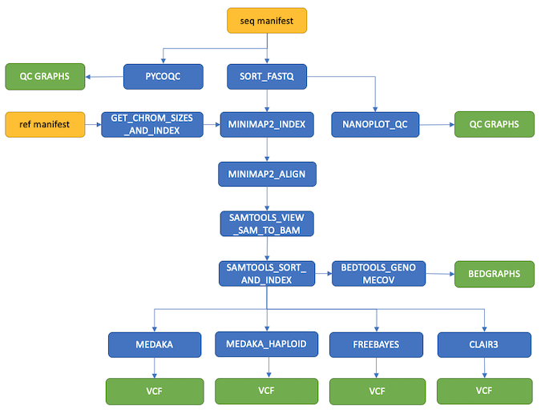

# nano-rave
Nextflow pipeline designed for rapid onsite QC and variant calling of Oxford Nanopore data (following basecalling and demultiplexing with [Guppy](https://nanoporetech.com/how-it-works/basecalling#_neural-networks)).

## Pipeline summary


## Getting started
### Running on a personal computer 
1. Install [`nextflow`](https://www.nextflow.io/docs/latest/getstarted.html).

2. Install [`Docker`](https://docs.docker.com/engine/installation/).

3. Run pipeline direct from Github repository.

   Example:
   ```bash
   nextflow run github.com/sanger-pathogens/nano-rave --sequencing_manifest ./test_data/pipeline/inputs/test_manifest.csv --reference_manifest ./test_data/pipeline/inputs/reference_manifest.csv --variant_caller medaka_haploid --min_barcode_dir_size 5 --results_dir my_output
   ```

   See [usage](#usage) for all available pipeline options.

4. Once your run has finished, check output in the `results_dir` and clean up any intermediate files. To do this (assuming no other pipelines are running from the current working directory) run:

   ```bash
   rm -rf work .nextflow*
   ```

### Running on the farm (Sanger HPC clusters)
1. Add the following line to `~/.bashrc` (if not already present):
   
   ```bash
   [[ -f  /software/pathogen/farm5 ]] && source /software/pathogen/etc/pathogen.profile
   ```

2. Source the updated .bashrc file

   ```bash
   source ~/.bashrc
   ```

3. Load the module
   ```bash
   module load nano-rave/<version>
   ```

4. The pipeline should now be directly available with the command `nano-rave`
   ```bash
   nano-rave --help
   ```

5. before excuting `nano-rave`, it is recommended to set the `$SINGULARITY_CACHEDIR` and `$NXF_SINGULARITY_CACHEDIR` environment variables so that they both point to a folder with enough space. This location is that one where singularity images supporting the pipeline dependencies will be downloaded; by default it is downloaded inside your home directory (spcifically in `${HOME}/.singularity/cache`), which has space limitations and will rapidly fill up, causing the pipeline to fail. On the Sanger HPC, it is recommended to point to a location on your lustre scratch space.

6. Start your analysis  

   To use the appropriate Sanger configuration, please run with `-profile sanger_local` option.
   Here is an example command:
   ```bash
   bsub -o nano-rave.o -e nano-rave.e -q long -n 4 -R "select[mem>16000] rusage[mem=16000]" -M16000 \
   nano-rave -profile sanger_local --sequencing_manifest ./test_data/pipeline/inputs/test_manifest.csv --reference_manifest ./test_data/pipeline/inputs/reference_manifest.csv --variant_caller medaka_haploid --min_barcode_dir_size 5 --results_dir my_output
   ```
   This will run the whole pipeline i.e. all per-sample processes within a single siubmitted job, so please tailor your resource request accordingly.

   NB: we are working on providing a `sanger_lsf` profile that will enable th e proper use of LSF cluster integration, meaning that each process is executed by submitting as a separate job on the HPC; under such configuration, you would be advised to submitted the main job (workflow head process) to the `oversubscribed` queue.  

   See [usage](#usage) for all available pipeline options.

7. Once your run has finished, check output in the `results_dir` and clean up any intermediate files. To do this (assuming no other pipelines are running from the current working directory) run:

   ```bash
   rm -rf work .nextflow*
   ```

## Usage
```
nextflow run main.nf

Options:
    --sequencing_manifest        Manifest containing paths to sequencing directories and sequencing summary files (mandatory)
    --reference_manifest         Manifest containing reference identifiers and paths to fastq reference files (mandatory)
    --results_dir                Specify results directory [default: ./nextflow_results] (optional)
    --variant_caller             Specify a variant caller to use [medaka (default), medaka_haploid, freebayes, clair3] (optional)
    --clair3_args                Specify clair3 variant calling parameters - must include model e.g. --clair3_args "--model_path /opt/models/r941_prom_sup_g5014" (optional)
    --min_barcode_dir_size       Specify the expected minimum size of the barcode directories, in MB. Must be > 0. [default: 10] (optional)
    --keep_bam_files             Save BAM files in results directory [default: false] (optional)
    --help                       Print this help message (optional)
```

### Note:
- Please refer to https://github.com/HKU-BAL/Clair3#usage for a comprehesive list of options that can be used with `--clair3_args`. 
Currently, by default, the software will assume you will want to variant call human chromosome contigs.
If this is not the case, or you wish to use a custom set of contigs, please see clair3 options `--include_all_ctgs` or `--ctg_name`.
You may also want to skip phasing with clair3 option `--no_phasing_for_fa` if this is not required or useful for you.


## Sequencing manifest format
The sequencing manifest is in a csv format and contains two columns

* `sequencing_dir`
: folder containing all the Oxford Nanopore sequencing data
* `sequence_summary_file`
: required for QC - usually found in the sequencing directory. In this file, the paths to the fast5 read files (first column) must be full/absolute paths. 

The pipeline assumes that `sequencing_dir` contains Guppy output for a particular sample. In particular, the parent and child folders of the given `sequencing_dir` assume the following structure:
```
<sample>/<sequencing_dir>/fastq_pass/barcode*
```
Where each `barcode*` directory contains `fastq.gz` files. Only `barcode*` directories whose total size on disk exceeds the threshold set with `--min_barcode_dir_size` are considered.

Example manifest:
```
sequencing_dir,sequence_summary_file
./test_data/PIPELINE/inputs/sample/sequencing_dir,./test_data/PIPELINE/inputs/sample/sequencing_dir/sequencing_summary.txt
```

Note: When using relative paths in the manifest, they are relative to the current working directory (from which `nextflow` is run).

## Reference manifest format
The reference manifest is in csv format and contains two columns

* `reference_id`
: identifier for the reference (e.g. gene name or reference genome name)
* `reference_path`
: path to the reference file (`fasta` format)

Example for amplicon data:
```
reference_id,reference_path
ama1,./test_data/PIPELINE/inputs/references/ref_target_gene_cds_seq_ama1.fasta
crt,./test_data/PIPELINE/inputs/references/ref_target_gene_cds_seq_crt.fasta
csp,./test_data/PIPELINE/inputs/references/ref_target_gene_cds_seq_csp.fasta
dhfr,./test_data/PIPELINE/inputs/references/ref_target_gene_cds_seq_dhfr.fasta
dhps,./test_data/PIPELINE/inputs/references/ref_target_gene_cds_seq_dhps.fasta
eba175_3d7,./test_data/PIPELINE/inputs/references/ref_target_gene_cds_seq_eba175_3d7.fasta
k13,./test_data/PIPELINE/inputs/references/ref_target_gene_cds_seq_k13.fasta
mdr1,./test_data/PIPELINE/inputs/references/ref_target_gene_cds_seq_mdr1.fasta
msp1,./test_data/PIPELINE/inputs/references/ref_target_gene_cds_seq_msp1.fasta
msp2,./test_data/PIPELINE/inputs/references/ref_target_gene_cds_seq_msp2.fasta
```

Note: When using relative paths in the manifest, they are relative to the current working directory (from which `nextflow` is run).

## Variant callers
Three variant callers are currently supported:

* `medaka`
: See [`medaka_variant` usage](https://github.com/nanoporetech/medaka/blob/v1.4.4/README.md#usage)
* `medaka_haploid`
: See [`medaka_haploid_variant` usage](https://github.com/nanoporetech/medaka/blob/v1.4.4/README.md#usage)
* `freebayes`
: See [`freebayes` usage](https://github.com/freebayes/freebayes)
* `clair3`
: See [`run_clair3.sh` usage](https://github.com/HKU-BAL/Clair3#usage)

## Software versions
The pipeline makes use of docker images to ensure reproducibility. This version of the pipeline uses the following software dependencies:

| Software  | Version | Image URL                                             |
|-----------|---------|-------------------------------------------------------|
| bedtools  | 2.29.2  | quay.io/biocontainers/bedtools:2.29.2--hc088bd4_0     |
| clair3    | 1.0.0   | docker.io/hkubal/clair3@sha256:3c4c6db3bb6118e3156630ee62de8f6afef7f7acc9215199f9b6c1b2e1926cf8   |
| freebayes | 1.3.5   | docker.io/gfanz/freebayes@sha256:d32bbce0216754bfc7e01ad6af18e74df3950fb900de69253107dc7bcf4e1351 |
| medaka    | 1.4.4   | quay.io/biocontainers/medaka:1.4.4--py38h130def0_0    |
| minimap2  | 2.17    | quay.io-biocontainers-minimap2:2.17--hed695b0_3       |
| nanoplot  | 1.38.0  | quay.io/biocontainers/nanoplot:1.38.0--pyhdfd78af_0   |
| pycoqc    | 2.5.2   | quay.io/biocontainers/pycoqc:2.5.2--py_0              |
| samtools  | 1.15.1  | quay.io/biocontainers/samtools:1.15.1--h1170115_0     |
| tabix     | 1.11    | quay.io/biocontainers/tabix:1.11--hdfd78af_0          |

## Contributions and testing

Developer contributions to this pipeline will only be accepted if all pipeline tests pass. To check:

1. Make your changes.

2. Download the test data. A utility script is provided:

   ```
   python3 scripts/download_test_data.py
   ```

3. Install [`nf-test`](https://code.askimed.com/nf-test/installation/) (>=0.7.0) and run the tests:

   ```
   nf-test test tests/*.nf.test
   ```

   If running on Sanger HPC cluster, add the option `--profile sanger_local`.

4. Submit a PR.

## Citations
If you use this pipeline for your analysis, please cite our paper:

> **Drug resistance and vaccine target surveillance of Plasmodium falciparum using nanopore sequencing in Ghana**
>
> Sophia T. Girgis, Edem Adika, Felix E. Nenyewodey, Dodzi K. Senoo Jnr, Joyce M. Ngoi, Kukua Bandoh, Oliver Lorenz, Guus van de Steeg, Alexandria J. R. Harrott, Sebastian Nsoh, Kim Judge, Richard D. Pearson, Jacob Almagro-Garcia, Samirah Saiid, Solomon Atampah, Enock K. Amoako, Collins M. Morang’a, Victor Asoala, Elrmion S. Adjei, William Burden, William Roberts-Sengier, Eleanor Drury, Megan L. Pierce, Sónia Gonçalves, Gordon A. Awandare, Dominic P. Kwiatkowski, Lucas N. Amenga-Etego & William L. Hamilton
> 
> _Nature Microbiology_ 8:2365–2377 (2023); doi: [10.1038/s41564-023-01516-6](https://doi.org/10.1038/s41564-023-01516-6).

Which was initially released as a pre-print:

> **Nanopore sequencing for real-time genomic surveillance of Plasmodium falciparum**
>
> Sophia T. Girgis, Edem Adika, Felix E. Nenyewodey, Dodzi K. Senoo Jnr, Joyce M. Ngoi, Kukua Bandoh, Oliver Lorenz, Guus van de Steeg, Sebastian Nsoh, Kim Judge, Richard D. Pearson, Jacob Almagro-Garcia, Samirah Saiid, Solomon Atampah, Enock K. Amoako, Collins M. Morang’a, Victor Asoala, Elrmion S. Adjei, William Burden, William Roberts-Sengier, Eleanor Drury, Sónia Gonçalves, Gordon A. Awandare, Dominic P. Kwiatkowski, Lucas N. Amenga-Etego, William L. Hamilton
>
> _bioRxiv_ 2022.12.20.521122; doi: [10.1101/2022.12.20.521122](https://doi.org/10.1101/2022.12.20.521122)

This pipeline was adapted from the [nf-core/nanoseq](https://github.com/nf-core/nanoseq) pipeline.

> A systematic benchmark of Nanopore long read RNA sequencing for transcript level analysis in human cell lines
>
> Ying Chen, Nadia M. Davidson, Yuk Kei Wan, Harshil Patel, Fei Yao, Hwee Meng Low, Christopher Hendra, Laura Watten, Andre Sim, Chelsea Sawyer, Viktoriia Iakovleva, Puay Leng Lee, Lixia Xin, Hui En Vanessa Ng, Jia Min Loo, Xuewen Ong, Hui Qi Amanda Ng, Jiaxu Wang, Wei Qian Casslynn Koh, Suk Yeah Polly Poon, Dominik Stanojevic, Hoang-Dai Tran, Kok Hao Edwin Lim, Shen Yon Toh, Philip Andrew Ewels, Huck-Hui Ng, N.Gopalakrishna Iyer, Alexandre Thiery, Wee Joo Chng, Leilei Chen, Ramanuj DasGupta, Mile Sikic, Yun-Shen Chan, Boon Ooi Patrick Tan, Yue Wan, Wai Leong Tam, Qiang Yu, Chiea Chuan Khor, Torsten Wüstefeld, Ploy N. Pratanwanich, Michael I. Love, Wee Siong Sho Goh, Sarah B. Ng, Alicia Oshlack, Jonathan Göke, SG-NEx consortium
>
> [bioRxiv 610741](https://www.biorxiv.org/content/10.1101/2021.04.21.440736v1); doi: [10.1101/610741](https://doi.org/10.1101/2021.04.21.440736)

A full list of citations for tools used in the pipeline is given in [CITATIONS.md](./CITATIONS.md)

## Copyright
Copyright (C) 2022,2023 Genome Research Ltd.
