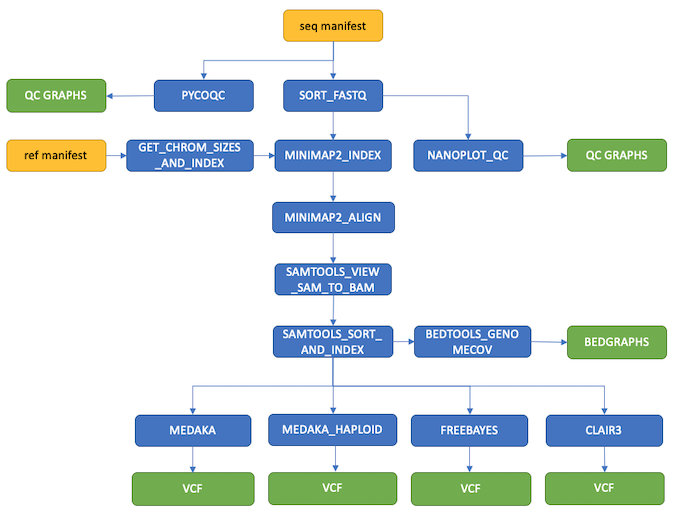

# nano-rave

[[_TOC_]]

## Pipeline overview

nano-rave is a Nextflow DSL2 pipeline for rapid QC and variant calling of Oxford Nanopore sequencing data. It is designed to run after basecalling and demultiplexing (e.g. with Dorado or Guppy) and processes per-sample FASTQ data produced by the basecaller.

The pipeline performs the following steps for each sample:

1. **Read filtering** — barcode directories below a configurable size threshold are skipped; passing reads are concatenated into per-sample FASTQ files.
2. **QC** — NanoPlot generates per-read quality statistics; PycoQC generates run-level QC reports from the sequencing summary file.
3. **Reference indexing** — references are normalised, indexed with Samtools, and indexed with Minimap2.
4. **Mapping** — reads are aligned to each reference with Minimap2 (`map-ont` preset), then sorted and indexed with Samtools.
5. **Coverage** — per-base genome coverage is computed with Bedtools genomecov.
6. **Variant calling** — one of four callers is applied (medaka, medaka_haploid, freebayes, or clair3); VCFs are bgzipped and indexed with Tabix.



The pipeline was originally developed and applied to _Plasmodium falciparum_ amplicon surveillance data and is described in:

> Girgis ST _et al._ **Drug resistance and vaccine target surveillance of Plasmodium falciparum using nanopore sequencing in Ghana.** _Nature Microbiology_ 8:2365–2377 (2023). doi: [10.1038/s41564-023-01516-6](https://doi.org/10.1038/s41564-023-01516-6)

## Usage

### Quickstart

#### From source code

1. Clone this repository:

   ```bash
   git clone <repo-url>
   cd nano-rave
   ```

2. Install [Nextflow](https://www.nextflow.io/docs/latest/getstarted.html) (>=21.04.0) and [Docker](https://docs.docker.com/engine/installation/).

3. Run the pipeline with the `-profile docker` option:

   ```bash
   nextflow run main.nf \
       -profile docker \
       --sequencing_manifest sequencing_manifest.csv \
       --reference_manifest reference_manifest.csv \
       --variant_caller medaka_haploid \
       --results_dir my_output
   ```

   Other profiles are also available: `singularity`, `conda`, `sanger_local`.

   > If no profile is specified the pipeline defaults to the `standard` profile (Docker enabled).

4. Once the run has finished successfully and you have inspected the output, clean up intermediate files. The `work/` directory and `.nextflow.log` are useful for troubleshooting — do not delete them until you are satisfied the outputs are correct:

   ```bash
   rm -rf work .nextflow*
   ```

   Alternatively, use `nextflow clean` for more fine-grained control over which runs and intermediate files are removed.

#### Using on the Sanger farm

The pipeline is available as an environment module on the Sanger HPC. Add the pathogen profile to your shell if not already present:

```bash
echo '[[ -f /software/pathogen/farm5 ]] && source /software/pathogen/etc/pathogen.profile' >> ~/.bashrc
source ~/.bashrc
```

Load the module:

```bash
module load nano-rave/<version>
```

Set the Singularity cache to a location with sufficient space (e.g. your lustre scratch):

```bash
export SINGULARITY_CACHEDIR=/path/to/lustre/scratch/.singularity
export NXF_SINGULARITY_CACHEDIR=/path/to/lustre/scratch/.singularity
```

Submit the pipeline to LSF using the `sanger_local` profile (all processes run within the submitted job):

```bash
bsub -o nano-rave.o -e nano-rave.e -q long -n 4 \
    -R "select[mem>16000] rusage[mem=16000]" -M16000 \
    nano-rave -profile sanger_local \
        --sequencing_manifest sequencing_manifest.csv \
        --reference_manifest reference_manifest.csv \
        --variant_caller medaka_haploid \
        --results_dir my_output
```

Use `nano-rave --help` to print all available options.

### Input

The pipeline requires two manifest files.

#### Sequencing manifest (`--sequencing_manifest`)

A CSV file with two columns:

| Column                  | Description                                                                                                                          |
| ----------------------- | ------------------------------------------------------------------------------------------------------------------------------------ |
| `sequencing_dir`        | Path to the directory containing basecaller output for a sample. Must contain a `fastq_pass/barcode*/` subdirectory structure.       |
| `sequence_summary_file` | Path to the sequencing summary file produced by the basecaller (used by PycoQC). Paths to FAST5 files in this file must be absolute. |

Example:

```
sequencing_dir,sequence_summary_file
/data/sample1/sequencing_dir,/data/sample1/sequencing_dir/sequencing_summary.txt
/data/sample2/sequencing_dir,/data/sample2/sequencing_dir/sequencing_summary.txt
```

The pipeline expects sequencing data to follow this directory structure:

```
<sample>/
  <sequencing_dir>/
    fastq_pass/
      barcode01/
        reads.fastq.gz
      barcode02/
        reads.fastq.gz
```

Only barcode directories whose total size exceeds `--min_barcode_dir_size` (default: 10 MB) are processed.

> When using relative paths in the manifest, they are relative to the directory from which `nextflow` is run.

#### Reference manifest (`--reference_manifest`)

A CSV file with two columns:

| Column           | Description                                                   |
| ---------------- | ------------------------------------------------------------- |
| `reference_id`   | Identifier for the reference (e.g. gene name or genome name). |
| `reference_path` | Path to the reference file in FASTA format.                   |

Example (amplicon data):

```
reference_id,reference_path
ama1,/data/references/ama1.fasta
crt,/data/references/crt.fasta
k13,/data/references/k13.fasta
```

### Output

Results are written to `--results_dir` (default: `./nextflow_results`) with the following structure:

```
nextflow_results/
  qc/
    nanoplot/
      <sample_barcode>_nanoplot_qc/    # Per-sample NanoPlot HTML reports and statistics
    pycoqc/
      <sample>_pycoqc.html             # Run-level PycoQC HTML report
      <sample>_pycoqc.json
  genome_coverage/
    <sample_barcode_reference>.bedGraph  # Per-base genome coverage
  variant_calling/
    vcf/
      <sample_barcode_reference>.vcf.gz     # Bgzipped, indexed VCF
      <sample_barcode_reference>.vcf.gz.tbi
    gvcf/                                   # Clair3 only
      <sample_barcode_reference>.gvcf.gz
      <sample_barcode_reference>.gvcf.gz.tbi
  bams/                                     # Only when --keep_bam_files is set
    <sample_barcode_reference>.sorted.bam
    <sample_barcode_reference>.sorted.bam.bai
```

### Parameters

**Required inputs**

| Option                  | Type   | Default                    | Description                                                                         |
| ----------------------- | ------ | -------------------------- | ----------------------------------------------------------------------------------- |
| `--sequencing_manifest` | `path` | —                          | Manifest CSV with `sequencing_dir` and `sequence_summary_file` columns (mandatory). |
| `--reference_manifest`  | `path` | `./reference_manifest.csv` | Manifest CSV with `reference_id` and `reference_path` columns (mandatory).          |

---

**Variant calling**

| Option             | Type     | Default  | Description                                                                                                 |
| ------------------ | -------- | -------- | ----------------------------------------------------------------------------------------------------------- |
| `--variant_caller` | `string` | `medaka` | Variant caller to use. One of: `medaka`, `medaka_haploid`, `freebayes`, `clair3`.                           |
| `--clair3_args`    | `string` | `""`     | Additional arguments to pass to Clair3. Must include `--model_path`. See [Advanced usage](#advanced-usage). |

---

**Read filtering**

| Option                   | Type      | Default | Description                                                           |
| ------------------------ | --------- | ------- | --------------------------------------------------------------------- |
| `--min_barcode_dir_size` | `integer` | `10`    | Minimum size (MB) of a barcode directory to be included. Must be > 0. |

---

**Output**

| Option             | Type      | Default              | Description                                                       |
| ------------------ | --------- | -------------------- | ----------------------------------------------------------------- |
| `--results_dir`    | `path`    | `./nextflow_results` | Directory where results are written.                              |
| `--keep_bam_files` | `boolean` | `false`              | Copy sorted BAM files and their indices to the results directory. |

---

**General**

| Option   | Type      | Default | Description                      |
| -------- | --------- | ------- | -------------------------------- |
| `--help` | `boolean` | `false` | Print the help message and exit. |

### Advanced usage

#### Clair3

Clair3 requires a basecalling model to be specified via `--clair3_args`. The model must be provided with the `--model_path` argument. The Clair3 container bundles a set of pre-trained models under `/opt/models/`:

```bash
nano-rave \
    --variant_caller clair3 \
    --clair3_args "--model_path /opt/models/r941_prom_sup_g5014" \
    ...
```

Refer to the [Clair3 documentation](https://github.com/HKU-BAL/Clair3#usage) for the full list of available options and models.

The following Clair3 options are reserved by the pipeline and cannot be passed via `--clair3_args`: `--bam_fn`, `--ref_fn`, `--threads`, `--platform`, `--output`.

By default Clair3 only calls variants on standard human chromosomes. For non-human or non-standard contigs, use `--include_all_ctgs` or `--ctg_name`. If phasing is not required, add `--no_phasing_for_fa`.

#### Profiles

| Profile        | Description                                                                            |
| -------------- | -------------------------------------------------------------------------------------- |
| `standard`     | Docker enabled (default).                                                              |
| `docker`       | Docker with user emulation.                                                            |
| `singularity`  | Singularity with auto-mounts.                                                          |
| `conda`        | Conda environments.                                                                    |
| `sanger_local` | Singularity configured for Sanger HPC paths (`/lustre`, `/nfs`, `/software`, `/data`). |

### Dependencies

All software dependencies are containerised in publicly available Docker images. No local installations are required beyond Nextflow and a container runtime (Docker or Singularity).

## Software versions

| Software  | Version | Image                                                                                               |
| --------- | ------- | --------------------------------------------------------------------------------------------------- |
| NanoPlot  | 1.38.0  | `quay.io/biocontainers/nanoplot:1.38.0--pyhdfd78af_0`                                               |
| PycoQC    | 2.5.2   | `quay.io/biocontainers/pycoqc:2.5.2--py_0`                                                          |
| Minimap2  | 2.17    | `quay.io/biocontainers/minimap2:2.17--hed695b0_3`                                                   |
| Samtools  | 1.15.1  | `quay.io/biocontainers/samtools:1.15.1--h1170115_0`                                                 |
| Bedtools  | 2.29.2  | `quay.io/biocontainers/bedtools:2.29.2--hc088bd4_0`                                                 |
| Medaka    | 1.4.4   | `quay.io/biocontainers/medaka:1.4.4--py38h130def0_0`                                                |
| FreeBayes | 1.3.5   | `docker.io/gfanz/freebayes@sha256:d32bbce0216754bfc7e01ad6af18e74df3950fb900de69253107dc7bcf4e1351` |
| Clair3    | 1.0.0   | `docker.io/hkubal/clair3@sha256:3c4c6db3bb6118e3156630ee62de8f6afef7f7acc9215199f9b6c1b2e1926cf8`   |
| Tabix     | 1.11    | `quay.io/biocontainers/tabix:1.11--hdfd78af_0`                                                      |

## Troubleshooting

- **Pipeline fails due to missing Singularity images**: ensure `$SINGULARITY_CACHEDIR` and `$NXF_SINGULARITY_CACHEDIR` point to a location with sufficient disk space (not your home directory, which has limited quota on the Sanger HPC).
- **No barcodes processed**: check that barcode directories contain at least `--min_barcode_dir_size` MB of compressed FASTQ data. Directories below the threshold are skipped with a warning in the log.
- **PycoQC fails**: verify that the paths to FAST5/POD5 files in the sequencing summary file are absolute paths.
- **Clair3 finds no variants**: if running on a non-human organism, add `--include_all_ctgs` or `--ctg_name <contig>` to `--clair3_args`.
- **Resuming a failed run**: add `-resume` to your `nextflow run` or `nano-rave` command to restart from cached intermediate results.
- For further help, check `.nextflow.log` and the per-process `.command.log` logs in the `work/` directory.

Sanger users may find [this page](https://ssg-confluence.internal.sanger.ac.uk/spaces/PaMI/pages/181078206/General+pipeline+info#Generalpipelineinfo-Troubleshootingafailedpipelinerunandsendingabugreport) useful for troubleshooting Nextflow pipeline runs.

## Issues and Contributions

**GitHub users:** if you find an issue with this pipeline or would like to suggest an improvement, please log an issue or open a pull request on this repository.

Developer contributions will only be accepted if all pipeline tests pass. To run the tests:

1. Download the test data:

   ```bash
   python3 scripts/download_test_data.py
   ```

2. Install [nf-test](https://code.askimed.com/nf-test/installation/) (>=0.7.0) and run:

   ```bash
   nf-test test tests/*.nf.test
   ```

   On the Sanger HPC, add `--profile sanger_local`.

**Sanger users:** if you need internal support, you can raise an issue on the PAM Freshservice portal: https://sanger.freshservice.com/support/catalog/items/426
